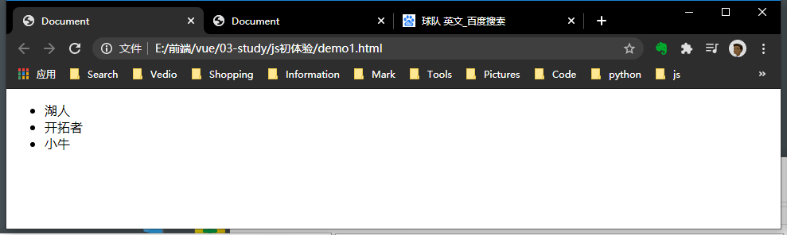
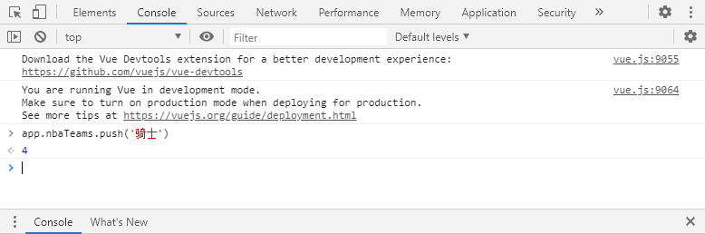

### 1.  Vue是渐进式框架
+ Vue可以作为应用的一部分
+ 渐进式：Vue的核心的功能，是一个视图模板引擎，但这不是说Vue就不能成为一个框架。如下图所示，这里包含了Vue的所有部件，在声明式渲染（视图模板引擎）的基础上，我们可以通过添加组件系统、客户端路由、大规模状态管理来构建一个完整的框架。更重要的是，这些功能相互独立，你可以在核心功能的基础上任意选用其他的部件，不一定要全部整合在一起。可以看到，**所说的“渐进式”，其实就是Vue的使用方式，同时也体现了Vue的设计的理念**
+ 全家桶 ？？？
<br/>

### 2.  Vue是渐进式框架
+ 解耦视图和数据（双向数据绑定）
+ 可复用组件
+ 状态管理
+ 虚拟DOM
<br/>

### 3.编程范式
##### 从命令式转为**声明式**
**3.1命令式**：
1、html中 创建html元素，设置id；
2、js中 创建变量获取html元素
3、修改变量中的数据
<br/>

例子：
```html
<body>
    <div id="app">
        <span></span>
        <span></span>
  </div>
  
    <script>
        let div = document.querySelector('#app');
        let span = div.querySelectorAll('span');
        span[0].innerHTML = 'hello';
        span[1].innerHTML = 'world';
    </script>
</body>
```
<br/>
**3.2 声明式**：
1、html中 创建html元素，设置id，插入“模板”’；
2、js中创建Vue对象挂载html元素，修改对象中数据，同步到html中
<br/>
看起来好像一样的，实际上分离了视图和数据操作
例子一：

```html
<body>
    <div id="app">
        <span>{{message}}</span>
        <span>{{info}}</span>
    </div>

    <script>
        const app = new Vue({
            el: '#app',
            data: {
                message: 'hello',
                info:'Vue'
            }
        })
    </script>
</body>
```
运行： 


<br/>

Vue是响应式的，随着数据变化而变化。

```html
<body>
    <div id="app">
        <ul>
            <li v-for='team in nbaTeams'>{{team}}</li>
        </ul>
    </div>

    <script>
        const app = new Vue({
            el: '#app',
            data: {
                nbaTeams: ['湖人', '开拓者', '小牛']
            }
        })
    </script>
</body>
```
运行：



<br/>

### 4.MVVM 

+ **view层**
  + 视图层，通常就是DOM层，展示数据。
+ **model层**
  + 数据层
  + 数据可能是我们固定的死数据，一般是来自我们请求服务器的数据。
+ **view-model层**
  + 视图模型层，是View和Model沟通的桥梁。
  + 一方面它实现了Data Binding，也就是数据绑定，将Model的改变实时的反应到View中。
  + 另一方面它实现了DOM Listener，也就是DOM监听，当DOM发生一些事件(点击、滚动、touch等)时，可以监听到，并在需要的情况下改变对应的Data。
<br/>

### 5.实例
#### 5.1实例化参数options
`new Vue(options)`
options是个对象

```js
let a = new Vue({
	// 挂载DOM元素
	el: String || HTMLElement,
    // vue实例的数据，注册变量，保存赋值
	data: Object || Function,
	// 方法
	methods: {[key:String]: Function}
})
```
<br / >

#### 5.2 data响应式
+ 当一个 Vue 实例被创建时，它将 data 对象中的所有的 property 加入到 Vue 的**响应式系统**中。
+ 当这些 property 的值发生改变时，视图将会产生“响应”，即更新值进行重渲染。
+ 值得注意的是***只有当实例被创建时就已经存在于 data 中的 property 才是响应式的。***
<br/>

#### 5.2 实例常用的property与方法
1. $前缀
vue暴露的实例property 和方法都有前缀$，以便与用户定义的区分。
```js
    const nbaTeams = ['湖人', '开拓者', '小牛'];
    const app = new Vue({
        el: '#app',
        data: {
            nbaTeams: nbaTeams
        }
    })
    console.log(app.$data.nbaTeams === nbaTeams); //true
```
```js
    const nbaTeams = { nbaTeams: ['湖人', '开拓者', '小牛']};
    const app = new Vue({
        el: '#app',
        data: nbaTeams
    })
    console.log(app.$data === nbaTeams); //true
```

2. $watch() 
监视属性值的变化
```js 
vm.$watch('proper', function(newvalue, oldvalue){
	// vm的proper属性改变后，调用此回调
})
```


### 6.生命周期
