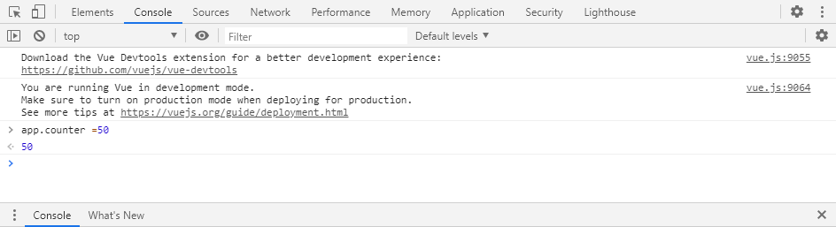
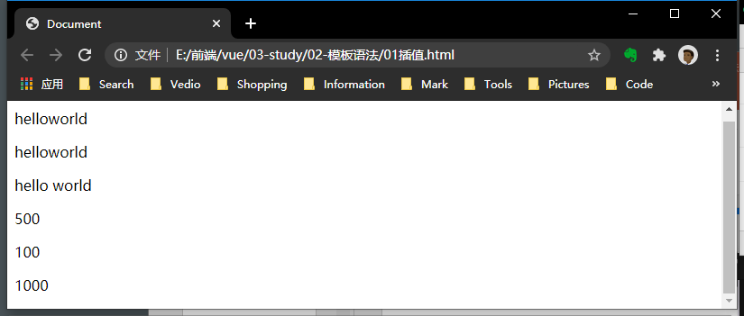
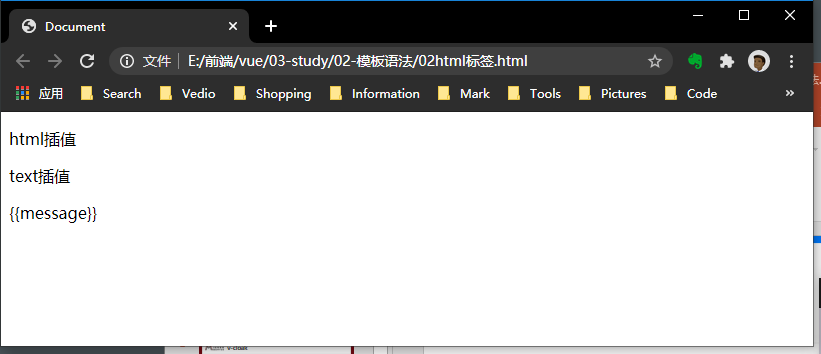
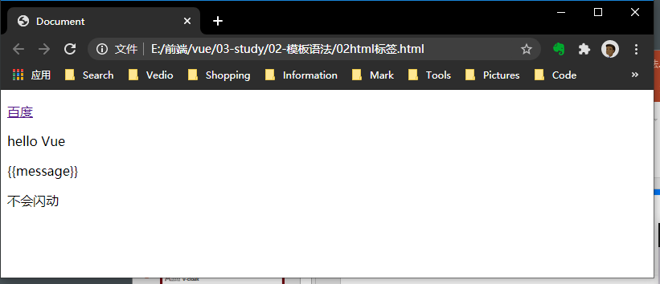
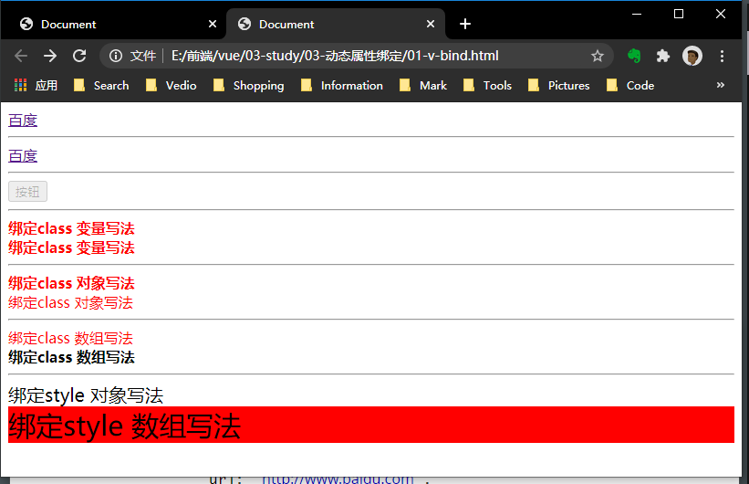

## 模板语法
### 1. 插值
#### 1.1 文本
#### 1.1.1 Mustache 
+ 语法：{{property}}
+ 绑定的数据对象上 property 发生了改变，插值处的内容都会更新
+ 加了V-once属性一次性取值，不会更新，
```html
<body>
	<div id="app1">
		<p>{{info}}{{message}}</p>
		<p>{{info + message}}</p>
		<p>{{info + ' ' + message}}</p>
		<p>{{counter*10}}</p>
		<p v-once>{{counter}}</p>
		<p v-once>{{counter*10}}</p>
	</div>

	<script>
		const app = new Vue({
			el: '#app1',
			data: {
				info: "hello",
				message: "world",
				counter: 100
			}
		})
	</script>
```
输出：

若修改值，view动态变化


<br />

#### 1.1.2  HTML和Text
1. 指令：v-html=“property”
+ 将数据对象中的数据作为HTML解析，并覆盖将标签中的文本内容。
+ 类似innerHtml。
+ tips：站点上动态渲染的任意 HTML 可能会非常危险，因为它很容易导致 XSS 攻击。请只对可信内容使用 HTML 插值，绝不要对用户提供的内容使用插值。
<br />
2. 指令：v-text=“property”
+ 将数据对象的属性解析为普通文本。
<br />
3. 指令：v-pre
+ 停止解析文本中的{{property}}语法
<br />
4. 指令：v-cloak
+ 未解析到js时，添加此指令的元素不会显示。
+ 若js延迟执行，会出现“先显示{{prperty}}的字面值（也就是未解析data上的数据），再显示数据对象上的数据”
```html
	<style>
		// 要写CSS的开头
		[v-cloak]{
			display: none;
		}
	</style>

<body>
	<div id="app1">
		<p v-html="url">html插值</p>
		<p v-html="message">text插值</p>
		<p v-pre>{{message}}</p>
		<p v-cloak>{{clock}}</p>
	</div>

	<script>
		setTimeout(() => {
			const app = new Vue({
				el: '#app1',
				data: {
					url: "<a href='http://www.baidu.com'>百度</a>",
					message: "hello Vue",
					clock: "不会闪动"
				}
			})
		}, 1000)
	</script>
</body>
```
输出：

1秒后：

<br />

### 2. 属性
#### 1.1 绑定属性
#### 指令：v-bind:Attribute
+ 简写 :Attribute
+ 绑定属性，动态修改。
1. 绑定href类型属性
   + 通过字符串```:href="url"```
   + 通过data中的属性值```:href=url```


2. 绑定布尔类型属性
   
+ 属性值为null、undefined、false为的属性，不会渲染到元素中。```<button disabled=isAbled>```
  

3. 绑定class属性
   对象写法：{k:v}的形式，k为字符串类名，v可以是data的属性值

   + 可以与未v-bind的class一起用，自动合并```<div class="bold" :class="{'painting': painting}">```
   + 属性值为null、undefined、false为的键名，不会渲染到元素中。```<div :class="{'painting': color, 'bold':bold}">```

   数组写法：
   + 通过data中变量```<div :class="[painting]">```
   + 通过 字符串```<div :class="['bold']">```


4. 绑定style属性
对象写法：```:style{k:v}``` k可以采用大驼峰（fontSzie）或者单引号（’font-size‘）的写法，v可以是字符串或者data中的属性值，**记得拼接成字符串**。
   
   + 通过变量绑定```<div :class="[painting]">```
+ 通过字符串绑定```<div :class="[painting]">```
   
   数组写法：
   + 通过data中变量```<div :class="[painting]">```
   + 通过 字符串```<div :class="['bold']">```

**规则：遇到变量就解析，遇到字符串直接使用**
例子：

```html
    <style>
        .painting {
            color: red;
        }

        .bold {
            font-weight: 700;
        }
    </style>

</head>

<body>
    <div id="app">
        <a v-bind:href="url">百度</a>
        <hr />
        <!-- 简写 -->
        <a :href="url">百度</a>
        <hr />
        <!-- 布尔属性 -->
        <button disabled=isAbled>按钮</button>
        <hr />
        <!-- 绑定class 变量写法-->
        <div class="bold" :class=test>绑定class 变量写法</div>
        <div class="bold" :class="painting">绑定class 变量写法</div>
        <hr />
        <!-- 绑定class 对象写法-->
        <div class="bold" :class="{'painting': painting}">绑定class 对象写法</div>
        <div :class="{'painting': color, 'bold':bold}">绑定class 对象写法</div>
        <hr />
        <!-- 绑定class 数组写法-->
        <div :class="[painting]">绑定class 数组写法</div>
        <div :class="['bold']">绑定class 数组写法</div>
        <hr />
        <!-- 绑定style 对象写法-->
        <div :style="{fontSize:fontsize + 'px'}">绑定style 对象写法</div>
        <div :style="[background]">绑定style 数组写法</div>
    </div>
    <script>
        const app = new Vue({
            el: '#app',
            data: {
                url: "http://www.baidu.com",
                isAbled: null || undefined || false,
                painting: 'painting',
                color: true,
                bold: false,
                test: 'painting',
                fontsize: 20,
                background: {
                    fontSize: '30px',
                    backgroundColor: 'red'
                }
            }
        })
    </script>
```
输出：
