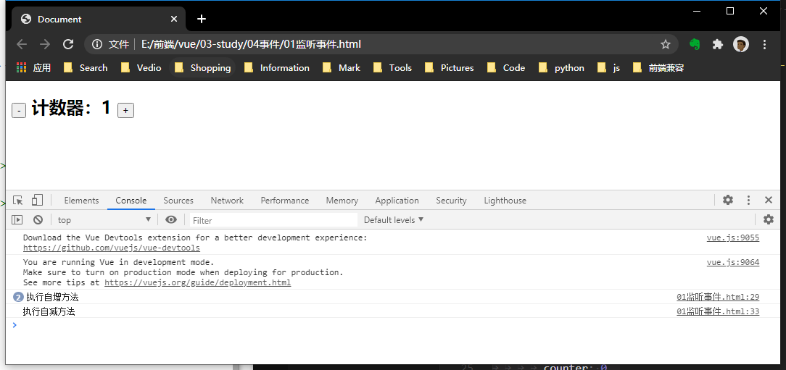
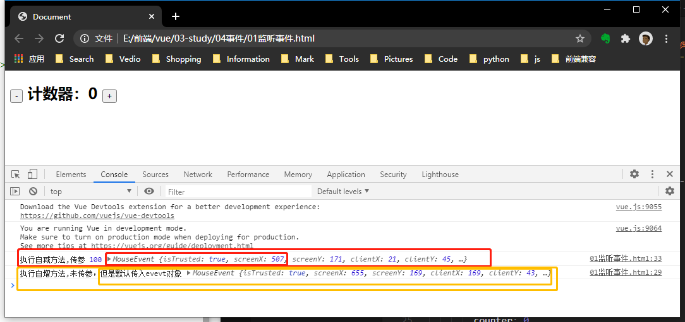

## 事件监听
### 1. 指令 
```v-on:事件类型="function"```,简写 ```@事件类型="function"```。

### 2. 事件回调
在Vue实例的menthods属性中定义对应回调function。
```html
<body>
	<div id="app">
		<h2>
			<button @click="decrement">-</button>
			计数器：{{counter}}
			<button @click="increment">+</button>
		</h2>
	</div>

	<script>
		const app = new Vue({
			el: '#app',
			data: {
				counter: 0,
			},
			methods: {
				increment() {
					console.log("执行自增方法");
					this.counter++
				},
				decrement() {
					console.log("执行自减方法");
					this.counter--;
				},
			}
		})
	</script>
</body>
```
运行：

<br />

### 3. 回调的参数
```html
<body>
	<div id="app">
		<h2>
			<button @click="decrement(100,$event)">-</button>
			计数器：{{counter}}
			<button @click="increment">+</button>
		</h2>
	</div>

	<script>
		const app = new Vue({
			el: '#app',
			data: {
				counter: 0,
			},
			methods: {
				increment(event) {
					console.log("执行自增方法,未传参，但是默认传入evevt对象", event);
					this.counter++
				},
				decrement(value, event) {
					console.log("执行自减方法,传参", value, event);
					this.counter--;
				},
			}
		})
	</script>
```
+ 若未传参，默认会将事件对象event传入
+ 若传参，且需要穿入入event对象时，可通过$event传入


<br />

### 4. 回调的修饰符
1. ```.stop``` 阻止冒泡
2. ```.prevent``` 阻止默认行为
3. ```.once``` 只触发一次
4. ```.native``` 监听组件根元素的原生事件
5. ```.keyCode | keyAlias``` 按下特定的键名或键码时触发
支持串写，一个事件用多个修饰符
```html
		<button @click.stop="doSomething">阻止冒泡</button>
		<button @click.prevent="doSomething">阻止默认行为</button>
		<form @submit.prevent>阻止表单提交的默认行为
			<input type="text" @keyup.enter="doSomething">
			<input type="text" @keyup.a="doSomething">
			<input type="submit" @keyup.enter.once="doSomething">
		</form>
```
<br />

