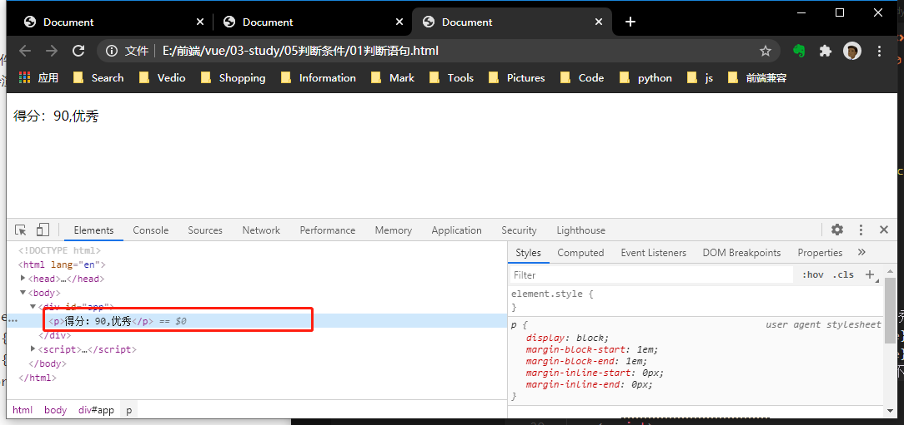
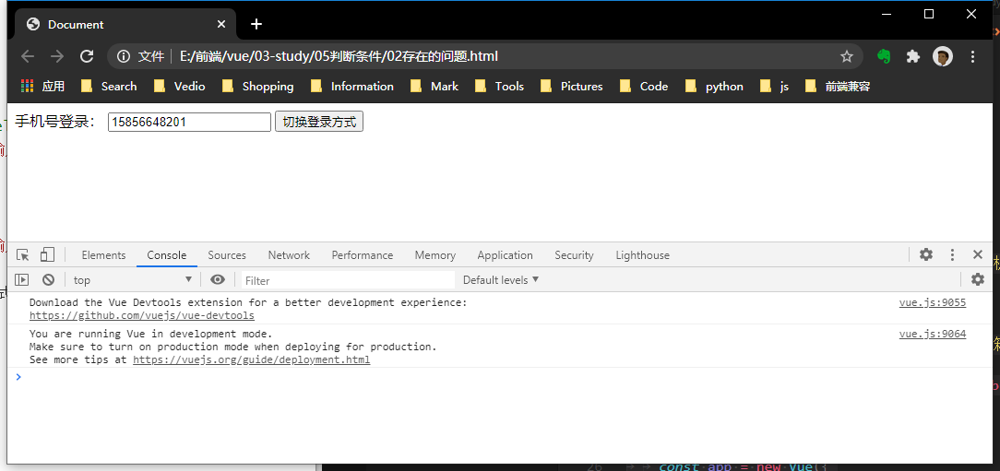
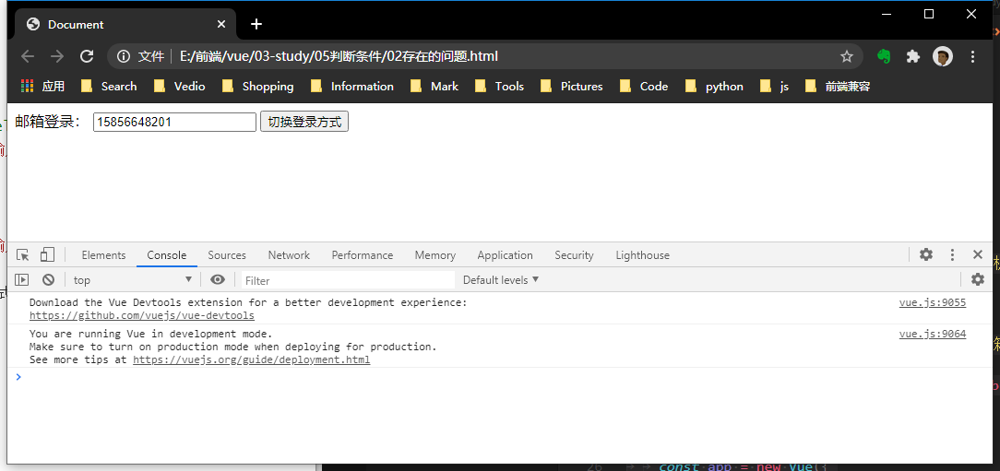
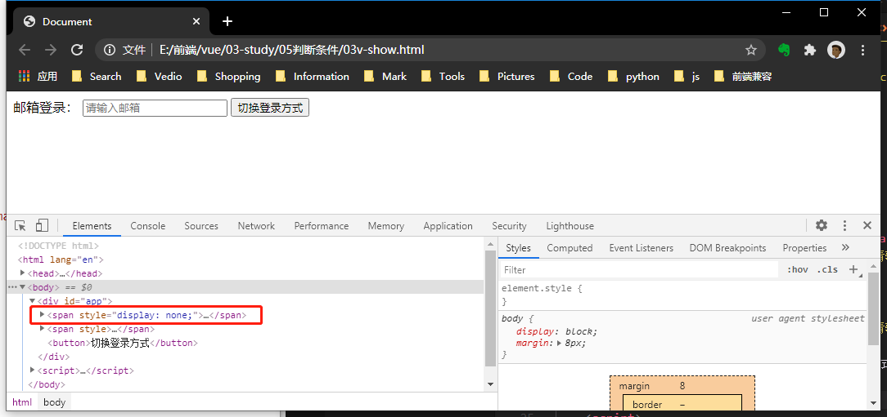

## 判断语句
根据指令的表达式的值在DOM中渲染或销毁元素或组件。
表达式的值为true渲染到DOM中，若为false根本不会渲染
### 1. v-if、v-else-if、v-else
```
v-if="表达式"
v-else-if="表达式"
v-else="表达式"
```
例子一：
```html
<body>
    <div id="app">
        <p v-if="score>=85">得分：{{score}},优秀</p>
        <p v-else-if="score>=70">得分：{{score}},良好</p>
        <p v-else-if="score>=60">得分：{{score}},及格</p>
        <p v-else="score<60">得分：{{score}},不及格</p>
    </div>

    <script>
        const app = new Vue({
            el: '#app',
            data: {
                score: 90
            }
        })
    </script>
</body>
```

<br />

例子二：
```html
<body>
	<div id="app">
		<span v-if="login==='phone'">
			<label for="phone">手机号登录：</label>
			<input type="text" placeholder="请输入手机号" id="phone">
		</span>
		<span v-else="login==='email'">
			<label for="">邮箱登录：</label>
			<input type="text" placeholder="请输入邮箱" id="email">
		</span>
		<button @click="checkLogin">切换登录方式</button>
	</div>

	<script>
		const app = new Vue({
			el: '#app',
			data: {
				login: 'phone'
			},
			methods: {
				checkLogin() {
					this.login = this.login === 'email' ? 'phone' : 'email';
				}
			}
		})
	</script>
</body>
```
运行：



问题：
  + 以上代码中，Vue在进行DOM渲染的时候，出于考虑性能，会尽可能服用已存在的元素，而不用先销毁再创建。这就导致了，已输入的input的值不会消失。

解决：
  + 如需解决，添加不用的key来确保唯一性。
```html
<input type="text" placeholder="请输入邮箱" id="email" key="email">
<input type="text" placeholder="请输入手机号" id="phone" key="phone">
```


### 2. v-show
```v-show**=“表达式”```
表达式的值为true渲染到DOM中，若为false会将元素隐藏而非销毁，即把元素的display属性改为none
```html
<body>
	<div id="app">
		<span v-show="login==='phone'">
			<label for="phone">手机号登录：</label>
			<input type="text" placeholder="请输入手机号" id="phone" key="phone">
		</span>
		<span v-show="login==='email'">
			<label for="">邮箱登录：</label>
			<input type="text" placeholder="请输入邮箱" id="email" key="email">
		</span>
		<button @click="checkLogin">切换登录方式</button>
	</div>

	<script>
		const app = new Vue({
			el: '#app',
			data: {
				login: 'phone'
			},
			methods: {
				checkLogin() {
					this.login = this.login === 'email' ? 'phone' : 'email';
				}
			}
		})
	</script>
</body>
```
运行：
