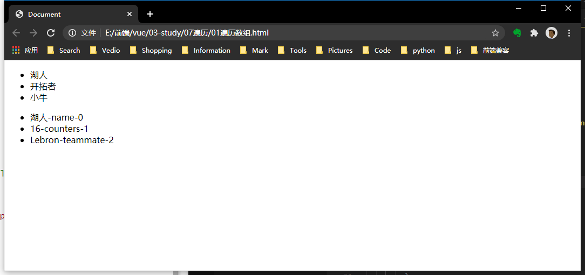

## 遍历
### 1. 指令
```js
//遍历数组
v-for="value in array"
v-for="(value, index) in array"

//遍历对象
v-for="value in obj"
v-for="(value, key) in obj"
v-for="(value, ,key, index) in obj"
```
1. 指令书写位置：什么元素需要重复，写在什么元素身上
2. **官方推荐，使用v-for属性时添加```:key属性```**。作用是给每个节点做唯一标识，提高Diff算法更新虚拟DOM映射到真实DOM的效率。否则引起不必要的内存空间修改，降级性能。
```html
<body>
	<div id="app">
		<ul>
			<li v-for='team in teams' :key="team">{{team}}</li>
		</ul>
		<ul>
			<li v-for='(value,key,index) in champions' :key="value"> {{value}}-{{key}}-{{index}}</li>
		</ul>
	</div>

	<script>
		const app = new Vue({
			el: '#app',
			data: {
				teams: ['湖人', '开拓者', '小牛'],
				champions: {
					name: '湖人',
					counters: 16,
					teammate: 'Lebron'
				}
			}
		})
		console.log(app.$data === nbaTeams);
	</script>
</body>
```

<br />

3. 数组的部分更新操作会引起view响应，而非所有操作。一般来说，不是通过索引修改的方法，都能引起响应。
   + Array.prototype.push()
   + Array.prototype.pop()
   + Array.prototype.shift()
   + Array.prototype.unshift()
   + Array.prototype.splice()
   + Array.prototype.sort()
   + Array.prototype.reverse()