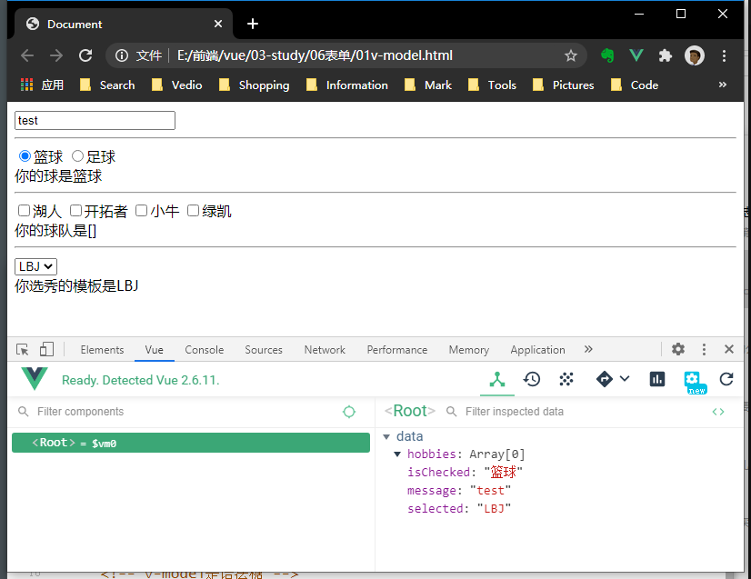

## 表单绑定
### 1. 双向绑定
+ 指令```v-model ```
+ 使用Mustache或者动态属性的方式，能做到响应式，但只是单向的。即：model数据的修改会引起view的更新渲染。但是view中数据的变化不会更新到model中。
+ 通过```v-model```可以实现双向绑定，view中数据一旦变化，就会立即更新到data中。本质是动态属性+事件监听的语法糖。
```html
<body>
	<div id="app">
		<input type="text" v-model="message">
		<!-- v-model是语法糖 -->
		<!-- <input type="text" name="" id="" :value="message" @input="getValue"> -->
		<hr />
		<!-- radio v-model绑定数组 选中状态，value值修改到v-model中 -->
		<input type="radio" v-model="isChecked" value="篮球">篮球
		<input type="radio" v-model="isChecked" value="足球">足球
		<div>你的球是{{isChecked}}</div>
		<hr />
		<!-- checkbox v-model绑定数组 选中状态，checkbox的value添加到数组中，反之为删除数组元素
    <!-- radio v-model绑定非数组 选中状态，value值为true，反之为fasle  -->
		<input type="checkbox" v-model="hobbies" value="湖人">湖人
		<input type="checkbox" v-model="hobbies" value="开拓者">开拓者
		<input type="checkbox" v-model="hobbies" value="小牛">小牛
		<input type="checkbox" v-model="hobbies" value="绿凯">绿凯
		<div>你的球队是{{hobbies}}</div>
	</div>
	<script>
		const app = new Vue({
			el: '#app',
			data: {
				message: 'test',
				isChecked: "篮球",
				hobbies: []
			},
			methods: {
				getValue(event) {
					this.message = event.target.value
				}
			}
		})
	</script>
</body>
```


### 2. 修饰符
```js
.lazy  //iuput按下回车或失去焦点时才更新
.number  //把内容当做数字处理，因为input中的内容默认会被当做String来处理（无论是否指定type="number"）
.trim  //过滤掉两端的空格。默认情况下虽然浏览器显示的时候会自动过滤，但是data中的数据还是会保留空格，此时就可以使用trim修饰符过滤首尾空格
```
