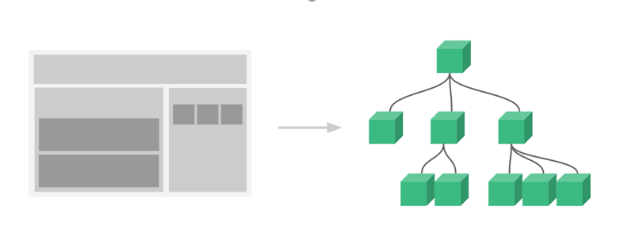
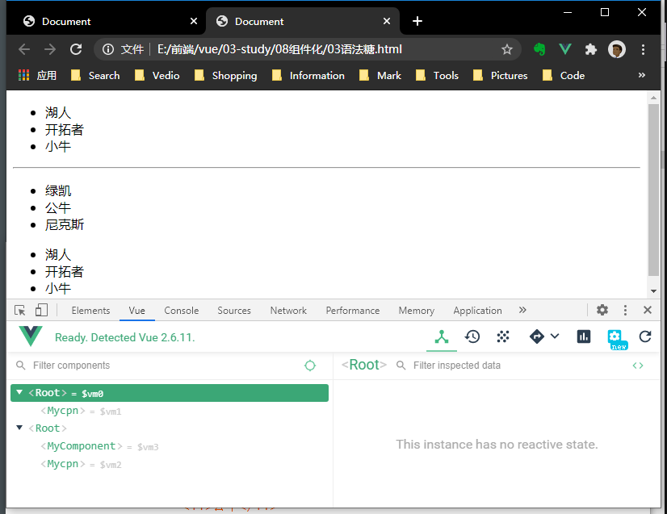
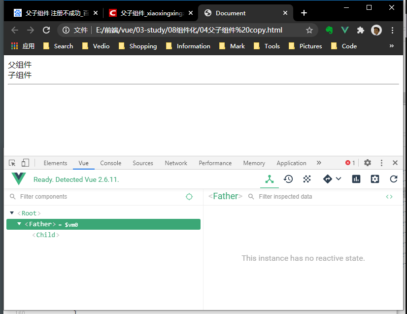
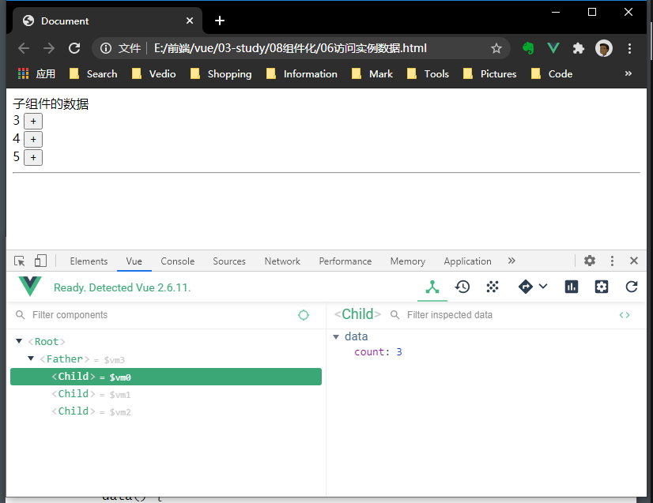
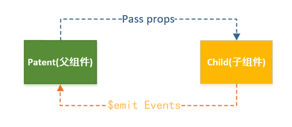
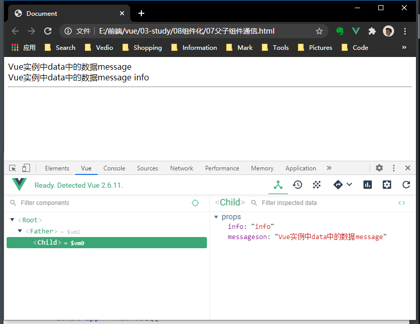
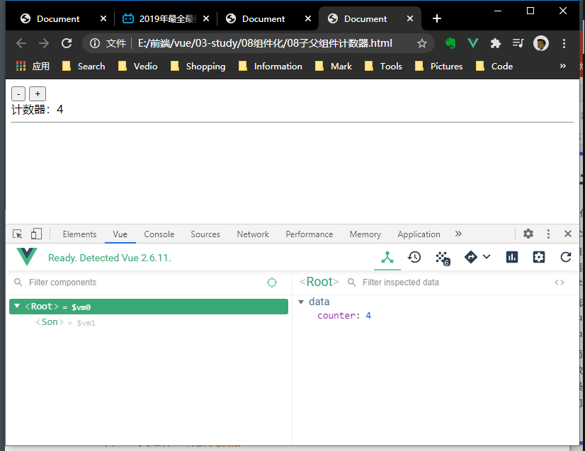
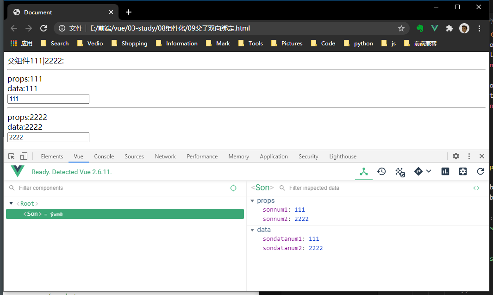

## 组件化
### 一. 简介
  + 它提供了一种抽象，让我们可以开发出一个个独立可复用的小组件来构造我们的应用。
  + 任何的应用都会被抽象成一颗组件树。


### 二.  基本步骤
1. 创建组件构造器
   + Vue.extend()传入自定义template创建组件构造器
```js
const myComponent = Vue.extend({
	template: `
      <div>
        <ul>
          <li>湖人</li>
          <li>开拓者</li>
          <li>小牛</li>
        </ul>
      </div>
  `

//语法糖

```

2. 注册组件
  + Vue.component(组件名称，组件构造器)通过组件构造器注册一个组件，并赋予名称。
  + 通过Vue.component()注册的组件是全局的，通过Vue实例注册，就是局部的。
```js
//全局组件，任何Vue实例都能使用
Vue.component('my-cpn', myComponent)

//局部组件，只能在注册Vue中使用
let app2 = new Vue({
	el: '#app2',
	components: {
  	'myComponent': myComponent
	}
})

// 2.注册全局组件语法糖
Vue.component('mycpn', 
	template: `
    <div>
      <ul   
      	<li>湖人</li>
        <li>开拓者</li>
        <li>小牛</li>
      </ul>
    </div>
    `
})

// 注册局部组件语法糖
let app2 = new Vue({
	el: '#app2',
	components: {
		'myComponent': {
			template: `
        <div>
          <ul>
            <li>绿凯</li>
            <li>公牛</li>
            <li>尼克斯</li>
          </ul>
        </div>
      `
		}
	}
})
```

3. 使用组件
  + 组件标签必须在Vue实例中使用，否则无法使用。
  + 组件名称：也就是最后使用的标签名。如果写成小驼峰形式，使用的时候需用-的形式。如Mycomponent，写成my-component。
```html
	<div id="app">
		<my-cpn></my-cpn>
	</div>
```

例子一：
```html
<body>
	<!-- 3 使用组件 -->
	<div id="app1">
		<mycpn></mycpn>
	</div>
	<hr />
	<div id="app2">
		<my-component></my-component>
		<mycpn></mycpn>
	</div>
	<script>
		// 注册全局组件语法糖
		Vue.component('mycpn', {
			template: `
        <div>
          <ul>
            <li>湖人</li>
            <li>开拓者</li>
            <li>小牛</li>
          </ul>
        </div>
      `
		})

		let app1 = new Vue({
			el: '#app1',

		})

		let app2 = new Vue({
			el: '#app2',
			components: {
				// 注册局部组件语法糖
				'myComponent': {
					template: `
        		<div>
          		<ul>
            		<li>绿凯</li>
            		<li>公牛</li>
            		<li>尼克斯</li>
          		</ul>
        		</div>
      		`
				}
			}
		})
	</script>
</body>
```
运行：

<br />

### 三. 父子组件
1. 子组件在父组件中注册。
2. 子组件只能在父组件中被识别使用。因为在编译父组件时，会连同编译子组件。
3. 父组件模板中使用子组件时，必须在一个根元素下。
```html
<body>
	<div id="app">
		<father></father>
		<child></child>
	</div>
	<hr />

	<script>
		//父组件
		Vue.component('father', {
			template: `
				<div>
					父组件
					<child></child>
				</div>
			`,
			// 子组件
			components: {
				'child': {
					template: `<div>子组件</div>`
				}
			}
		})

		const app = new Vue({
			el: '#app',
		})
	</script>
</body>
```
运行：


### 四. 模板分离写法
1. 使用script标签
2. 使用template标签
```html
<body>
	<div id="app">
		<father></father>
	</div>
	<hr />
	<template id="father">
		<div>
			父组件
			<child></child>
		</div>
	</template>
	<script type="text/x-template" id="son">
		<div>子组件</div>
	</script>
	<script>
		Vue.component('father', {
			template: '#father',
			components: {
				'child': {
					template: '#son'
				}
			}
		})

		const app = new Vue({
			el: '#app',
		})
	</script>
</body>
```
<br />


### 五. 访问实例数据
组件不能直接访问实例data中的数据。

1. 组件的数据存放
   + 来源：组件的data()函数返回的对象。为什么是data()函数？因为函数调用后返回不同的对象，这样能保证每个组件拿到数据都是独立的。
```html
<body>
	<div id="app">
		<father></father>
	</div>
	<hr />

	<template id="father">
		<div>
			{{messsage}}
			<child></child>
			<child></child>
			<child></child>
		</div>
	</template>

	<script type="text/x-template" id="son">
        <div>{{count}}
            <button @click="increment">+</button>
        </div>
    </script>

	<script>
		Vue.component('father', {
			template: '#father',
			components: {
				'child': {
					template: '#son',
					//子组件数据
					data() {
						return { count: 0 }
					},
					methods: {
						increment() {
							this.count++
						}
					}
				}
			},
			//父组件数据
			data() {
				return { messsage: '子组件的数据' }
			}
		})

		const app = new Vue({
			el: '#app',
		})
	</script>
</body>
```
运行:

<br />

### 六. 父子组件的通信
之前的组建的数据都是相互独立的，即：子组件无法获得父组件的数据，父组件也无法获得子组件的数据。常规的做法：父组件请求服务器，将数据传给子组件。
通信方式：

  + 父传子：通过props属性
  + 子传父：通过消息事件

<br />
1. 父传子
本质：子组件通过动态属性来保存父组件的传来的值，并将动态属性保存到props中。子组件使用props中的数据。
   + 第一步：在使用子组件标签中加入动态属性```:属性名="父组件的传来的属性"```来绑定传来的数据。
   + 第二步：在子组件定义中通过props属性接收父组件传来的数据。
   + 第三步：在子组件中使用props中的属性来使用数据。
   + 若props定义为数组，数组中的字符串就是传递时的名称。
   + 若props定义为对象。对象可以设置类型、默认值等。
```html
<body>
	<div id="app">
		<!-- 2.绑定传来的message数据 ，传递给props-->
		<father :messagefather="message"></father>
	</div>
	<hr />

	<template id="father">
		<div>
			<!-- 4.使用props中数据 -->
			{{messagefather}}
			<!-- 5.绑定传来的message数据 ，传递给props-->
			<child :messageson="messagefather" info="info"></child>
		</div>
	</template>

	<script type="text/x-template" id="son">
    <div>
			<!-- 7.使用props中数据 -->
			{{messageson}}
			{{info}}
		</div>
  </script>

	<script>
		let father = Vue.extend({
			template: '#father',
			components: {
				'child': {
					template: '#son',
					// 6.使用数组接收传递的数据messageson
					props: ['messageson', 'info']
				}
			},
			// 3.使用对象接收传递的数据messagefather，验证类型
			props: {
				messagefather: {
					type: String, //验证数据类型 [String,number]
					required: true, //必填
					default: function () {   //默认值
						return { message: 'hello' }
					},
					vaildator: function (value) {
						return [1, 2, 3].indexOf(value) !== -1
					}
				}
			}
		})

		const app = new Vue({
			el: '#app',
			// 1. 源数据：如接收服务器数据
			data: {
				message: 'Vue实例中data中的数据message'
			},
			components: {
				'father': father
			},
		})
	</script>
</body>
```
运行：

<br / >

2. 子传父
本质：子组件发送自定义事件和值，父组件监听自定义事件，通过回调获取值。
   + 值传递：修改父中的数据将不会修改子组件中数据。
第一步：子组件上监听事件。
第二步：子组件定义回调，通过$emit()方法向父组件发送自定义事件和数据。
第三步：父组件监听自定义事件。
第四步：父组件通过回调接收处理数据。回调函数形参默认会接收传来的数据。
```html
<body>
	<div id="app">
		<!-- 3.父组件中监听自定义事件 -->
		<son :name="name" @sonclick="getsondata"></son>
	</div>
	<hr />

	<template id="son">
		<!-- 1. 子组件上通过回调发送数据 -->
		<div @click="reportdata(name)">
			父组件
			{{ name }}
		</div>
	</template>

	<script>
		Vue.component('son', {
			template: '#son',
			props: ['name'],
			methods: {
				// 2.定义回调，通过$emit()函数发送自定义事件，和需要传递的数据
				reportdata(name) {
					console.log("开始向父组件发送数据", name);
					this.$emit('sonclick', name)
				}
			}
		})

		const app = new Vue({
			el: '#app',
			data: {
				name: 'LBJ'
			},
			methods: {
				// 4.父组件回调接收数据
				getsondata(name) {
					console.log("开始接收子组件数据", name);
				}
			}
		})
	</script>
</body>
```
运行：
上代码中，增减操作在子组件中，数据传递给父组件来显示。

<br / >

3. 父子间双向绑定
props的属性不能用于动态绑定，可通过data()再转一次做到双向绑定。
props的属性只能根据父组件的data值响应。
```html
<body>
	<div id="app">
		父组件{{number1}}|{{number2}}:
		<hr />
		<son 
			:sonnum1="number1" 
			:sonnum2="number2" 
			@sonsum1="getsonnum1" 
			@sonsum2="getsonnum2">
		</son>
	</div>

	<template id="son">
		<div>
			<div>props:{{sonnum1}}</div>
			<div>data:{{sondatanum1}}</div>
			<div><input type="text" :value="sondatanum1" @input="setsonnum1"></div>
			<hr />
			<div>props:{{sonnum2}}</div>
			<div>data:{{sondatanum2}}</div>
			<div><input type="text" :value="sondatanum2" @input="setsonnum2"></div>
		</div>
	</template>

	<script>
		const app = new Vue({
			el: '#app',
			data: {
				number1: 1,
				number2: 2
			},
			methods: {
				getsonnum1(value) {
					this.number1 = value
				},
				getsonnum2(value) {
					this.number2 = value
				}
			},
			components: {
				'son': {
					template: '#son',
					data() {
						return {
							sondatanum1: this.sonnum1,
							sondatanum2: this.sonnum2
						}
					},
					props: {
						sonnum1: Number,
						sonnum2: Number
					},
					methods: {
						setsonnum1(event) {
							this.sondatanum1 = parseInt(event.target.value)
							this.$emit('sonsum1', this.sondatanum1)
						},
						setsonnum2(event) {
							this.sondatanum2 = parseInt(event.target.value)
							this.$emit('sonsum2', this.sondatanum2)
						}
					}
				}
			}
		})
	</script>
</body>
```
<br />
运行：
