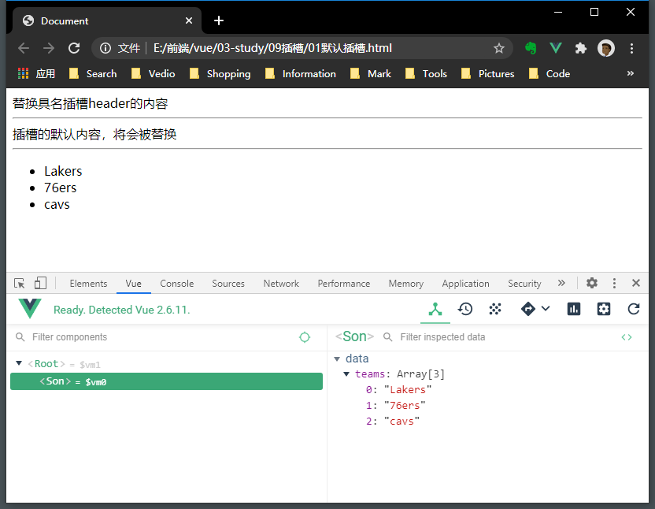

## 插槽
### 一.编译作用域
父组件模板的所有数据、属性都会在父级作用域内编译；
子组件模板的所有数据、属性都会在子级作用域内编译；

### 二.组件的插槽
组件的扩展，在组件中预留空位，可以容纳其他用户自定义新组件放入其中。
1. 默认插槽
使用```<slot>默认插槽</slot>``` 定义默认插槽。
2. 具名插槽
当组件内有多个插槽时，可给slot指定name属性```<slot name="header">具名插槽</slot>```，在通过```<template v-slot:header></template>```来指定插槽。

### 三. 作用域插槽
父组件替换插槽的内容并决定展示方式，但是数据由子组件来提供。
子组件通过动态属性```<slot name="footer" :sonteams="teams">作用域插槽</slot>```将数据绑定。在父组件template中通过props属性接收传来的属性```<template v-slot:footer="slotProps"></template>```
<br />

例子：
```html
<body>
  <div id="app">
    <son>
      <template v-slot:header>
        <span>替换具名插槽header的内容</span>
      </template>
      <template v-slot:footer="slotProps">
        <ul>
          <li v-for="team in slotProps.sonteams">{{team}}</li>
        </ul>
      </template>
    </son>
  </div>

  <template id="son">
    <div>
      <slot name="header">具名插槽header</slot>
      <hr />
      <slot>插槽的默认内容，将会被替换</slot>
      <hr />
      <slot name="footer" :sonteams="teams">作用域插槽</slot>
    </div>
  </template>

  <script>
    const app = new Vue({
      el: '#app',
      components: {
        son: {
          template: '#son',
          data() {
            return {
              teams: ['Lakers', '76ers', 'cavs']
            }
          }
        }
      }
    })
  </script>
</body>
```
运行：


